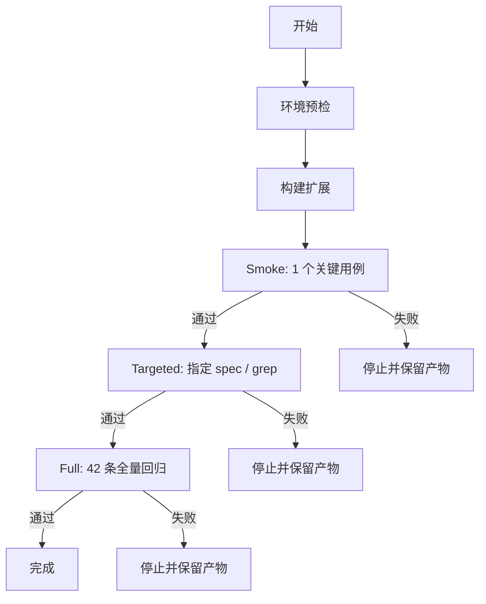

# 宿主机 Headed Playwright 固定验证流程设计

**Date:** 2026-06-01  
**Status:** Draft  
**Scope:** 为当前宿主机环境建立可复用、可回放的 headed E2E 验证流程

## 1. 背景

当前项目已经具备 Playwright E2E 测试，但之前在无显示器容器环境中运行时，存在以下问题：

- `headless-shell` 在部分机器上会崩溃
- headless 模式和有头模式的时序差异会导致 UI 断言不稳定
- `test-results/.last-run.json` 可能因权限问题写失败
- 扩展 sidepanel / service worker 初始化偶发超时

与此同时，当前宿主机环境已经验证可以稳定启动有头 Chromium，并能完成复杂交互：

- 启动扩展
- 打开 sidepanel
- 创建真实标签页
- 执行 Ctrl / Shift 选择
- 截图与读取 UI 状态

因此，本设计的目标不是重写测试，而是把“在宿主机上如何稳定跑 headed E2E”固化成一套后续可复用的流程。

## 2. 目标

### 2.1 主要目标

- 提供一套固定的 headed E2E 验证流程
- 让同一套命令可用于 smoke、指定用例、全量回归
- 把环境约定、失败分类、产物回收统一起来
- 让排障过程可重复，而不是依赖临时手工操作

### 2.2 成功标准

- 可以在宿主机上启动 headed Chromium 并加载扩展
- 可以稳定执行至少一个关键 sidepanel 用例
- 可以按需只跑单个 spec / 单个 grep 用例
- 可以在失败时保留截图、error context、trace（若启用）
- 不再依赖仓库内 `test-results/` 可写

## 3. 非目标

- 不替代 CI 的 headless E2E
- 不解决 Docker/Xvfb/headless-shell 路径上的问题
- 不重构现有测试本身的业务断言
- 不引入新的测试框架
- 不把所有 E2E 统一迁移为录制回放模式

## 4. 设计概览

本流程按 **三层验证模式** 组织：

1. **Smoke**：最小可运行性检查，确认浏览器、扩展、sidepanel、调试接口可用
2. **Targeted**：针对单个问题或单个用例集进行验证
3. **Full**：全量 42 条回归，仅在前两层通过后执行

### 4.1 流程图



## 5. 流程组件

### 5.1 环境预检

负责确认宿主机运行条件是否满足。

**检查项：**

- Playwright Chromium 可执行文件可用
- `VITE_E2E_TEST=true` 会被传入构建环境
- 输出目录是当前进程可写的临时目录
- 不使用仓库根目录下的 `test-results/.last-run.json` 作为唯一产物
- 若宿主机 Chromium 路径可变，支持通过 `PLAYWRIGHT_CHROMIUM_EXECUTABLE_PATH` 覆盖

**预检失败时：**
- 直接停止，不进入测试执行
- 输出明确错误：缺少浏览器、权限不足、路径不可用、环境变量缺失

### 5.2 构建阶段

负责把扩展构建成 Playwright 可以加载的 `dist/`。

**固定约定：**

- 构建前开启 `VITE_E2E_TEST=true`
- 构建后由 Playwright 读取 `dist/` 作为扩展目录

**构建失败时：**
- 记录构建日志
- 不进入浏览器启动

### 5.3 Smoke 层

负责验证最小路径：浏览器 → 扩展 → sidepanel → 调试接口。

**推荐用例：**
- `sidepanel 加载后显示标签`
- 或 `选择模式：Ctrl+点击切换标签选中状态`

**要求：**
- 只跑 1 个代表性用例
- 一旦失败，立即停止
- 该层的目标是确认“运行链路没坏”，不是做回归覆盖率

### 5.4 Targeted 层

负责验证某个具体交互、某个 bug 修复、某个局部回归。

**输入方式：**
- spec 文件名
- `-g` / `--grep` 关键词
- 必要时可限制到单个 test name

**要求：**
- 跑之前必须先通过 smoke
- 输出必须保留到独立目录
- 结果要带截图 / error context，方便回看

### 5.5 Full 层

负责全量 42 条 headed 回归。

**要求：**
- 只有 smoke 与 targeted 都通过后才进入
- 任何失败都应停止，不继续伪装成“最终结果”
- 该层用于宿主机真实浏览器下的完整验证，不用于日常每次调试

## 6. 固定运行约定

### 6.1 必须固定的参数

- `VITE_E2E_TEST=true`
- `--headed`
- `--output=/tmp/tabm-e2e/run-20260601-001`
- 明确的 Chromium 可执行路径优先级：
  1. `PLAYWRIGHT_CHROMIUM_EXECUTABLE_PATH`
  2. 当前已验证的默认 Playwright Chromium 路径

### 6.2 必须避免的路径

- 不依赖 `headless-shell`
- 不依赖 `xvfb`
- 不依赖 Docker 中的 X11 / DISPLAY
- 不把仓库里的 `test-results/` 当成唯一可写输出区

### 6.3 推荐输出目录结构

每次运行都落到独立临时目录，例如：

```text
/tmp/tabm-e2e/run-20260601-001/
  ├─ stdout.log
  ├─ screenshots/
  ├─ traces/
  └─ playwright-artifacts/
```

这样可以避免多次运行互相覆盖，也便于失败后整体打包回看。

## 7. 失败分类与处理

### 7.1 环境型失败

这类失败说明验证流程本身不稳定，而不一定是业务 bug。

**典型信号：**
- `browserContext.waitForEvent("serviceworker")` 超时
- `Target page, context or browser has been closed`
- `EACCES` / 输出目录权限错误
- 浏览器进程启动后立刻退出
- sidepanel 根本无法打开

**处理：**
- 先停下，不继续跑后续层级
- 记录为环境问题
- 优先修正启动方式、输出目录或宿主机浏览器路径

### 7.2 业务型失败

这类失败说明测试覆盖到了真实行为问题。

**典型信号：**
- 断言不成立
- UI 元素存在但状态不对
- 选择 / 搜索 / 折叠 / 关闭 / 拖拽的结果不符合预期

**处理：**
- 依赖截图、trace、error context 进行复现
- 只聚焦当前层级，不用全量回归掩盖问题

## 8. 落地形态

本设计建议最终落成两部分：

### 8.1 命令入口

提供固定 npm scripts，至少覆盖：

- smoke
- targeted
- full

必要时再增加一个接受 grep 参数的便捷入口。

### 8.2 文档说明

补一份本地 headed E2E 操作说明，至少写清：

- 运行前准备
- 浏览器路径如何指定
- 如何跑 smoke / targeted / full
- 输出文件在哪里
- 常见失败如何判断是环境还是业务

## 9. 验收标准

当这套流程落地后，应该满足：

1. 在宿主机上可以稳定跑通至少一个 headed smoke 用例
2. 可以通过统一入口跑单个用例 / 单个 spec / 全量回归
3. 失败时能明确留下证据，而不是只得到一句“测试失败”
4. 不再被 `test-results/.last-run.json` 的权限问题阻断
5. 不再依赖 headless-shell 或 Docker 图形栈

## 10. 风险与缓解

| 风险 | 影响 | 缓解 |
|---|---|---|
| 跑法过度碎片化 | 新同学不知道先跑哪个 | 固定 smoke → targeted → full 三层 |
| 临时目录过多 | 产物分散，不好找 | 统一命名规则和目录结构 |
| 浏览器路径变化 | 某些机器上找不到 Chromium | 保留环境变量覆盖入口 |
| 仍有少量 headed 时序抖动 | 个别用例偶发超时 | 先把失败分类清楚，再考虑是否需要用例重写 |

## 11. 测试策略

这套设计本身不引入新的业务逻辑，因此验证重点不是单元测试，而是运行流程验证：

- smoke 是否能稳定打开扩展并完成一个关键用例
- targeted 是否能稳定复现一个指定用例
- full 是否能在宿主机上跑到终点，或在失败时给出足够产物

如果后续在实现中新增脚本或配置，再补相应的配置测试或脚本 smoke 检查。
